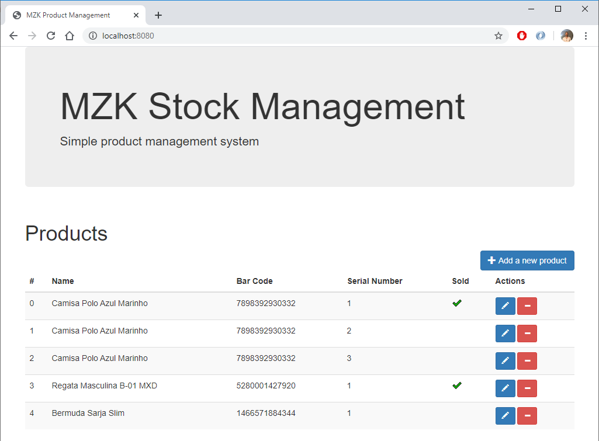
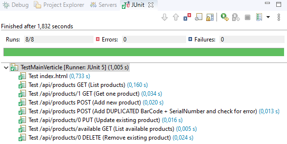

= Stock MZK - Mozaiko Java developer job test

image:https://img.shields.io/badge/vert.x-3.8.5-purple.svg[link="https://vertx.io"]

This application was generated using http://start.vertx.io

== Mozaiko Java developer test

* https://github.com/brunoaduarte/stock-mzk/blob/master/docs/teste_java_dev.pdf[Descrição do teste]

Apesar de especificado que não era necessário um "cliente" para teste das APIs, coloquei um HTML simples (index.html) com as funções básicas para teste do CRUD (Listagem, criação, alteração e remoção) que fica disponível em `http://localhost:8080/` quando o servidor é executado.



Nota: como não foi deixado claro como seria dado "baixa" nos produtos vendidos, implementei um campo 'sold' para sinalizar uma venda.
Está disponível também o método DELETE, mas não é recomendada sua utilização pois ele apaga totalmente o registro do sistema, inviabilizando uma geração de relatórios de produtos vendidos por exemplo.

= REST API

O único endpoint disponível na API é o endereço http://localhost:8080/api/products , e nele foi implementado o CRUD.

== Lista de produtos

=== Request

`GET /api/products`

    curl -i -H 'Accept: application/json' http://localhost:8080/api/products

=== Response

  HTTP/1.1 200 OK
  content-type: application/json; charset=utf-8
  content-length: 552
  [ {
    "id" : 0,
    "name" : "Camisa Polo Azul Marinho",
    "barCode" : 7898392930332,
    "serialNumber" : 1,
    "sold": false
  }, {
    "id" : 1,
    "name" : "Camisa Polo Azul Marinho",
    "barCode" : 7898392930332,
    "serialNumber" : 2,
    "sold": false
  }, {
    "id" : 2,
    "name" : "Camisa Polo Azul Marinho",
    "barCode" : 7898392930332,
    "serialNumber" : 3,
    "sold": false
  }, {
    "id" : 3,
    "name" : "Regata Masculina B-01 MXD",
    "barCode" : 5280001427920,
    "serialNumber" : 1,
    "sold": false
  }, {
    "id" : 4,
    "name" : "Bermuda Sarja Slim",
    "barCode" : 1466571884344,
    "serialNumber" : 1,
    "sold": false
  }]

== Lê um produto

=== Request

`GET /api/products/0`

    curl -i -H 'Accept: application/json' http://localhost:8080/api/products/0

=== Response

  HTTP/1.1 200 OK
  content-type: application/json; charset=utf-8
  content-length: 109
  {
    "id" : 0,
    "name" : "Camisa Polo Azul Marinho",
    "barCode" : 7898392930332,
    "serialNumber" : 1,
    "sold": false
  }
  
== Adiciona um produto

=== Request

`POST /api/products`

    curl -i -H 'Accept: application/json' -d '{"name":"Test","barCode":1, "serialNumber":1, "sold": false}' http://localhost:8080/api/products

=== Response

  HTTP/1.1 201 Created
  content-type: application/json; charset=utf-8
  content-length: 77

  {
    "id" : 5,
    "name" : "Test",
    "barCode" : 1,
    "serialNumber" : 1,
    "sold": false
  }
  
== Altera um produto

=== Request

`PUT /api/products/0`

    curl -X PUT -H 'Accept: application/json' -d '{"name":"Alterado","barCode":2, "serialNumber":2, "sold": true}' http://localhost:8080/api/products/0

=== Response

  {
    "id" : 0,
    "name" : "Alterado",
    "barCode" : 2,
    "serialNumber" : 2,
    "sold": true
  }
  
== Apaga um produto

=== Request

`DELETE /api/products/0`

    curl -X DELETE http://localhost:8080/api/products/0

=== Response

  HTTP/1.1 204 No Content
  
= Resultado dos testes unitários em IDE



== Building

To launch your tests:
```
./mvnw clean test
```

To package your application:
```
./mvnw clean package
```

To run your application:
```
./mvnw clean compile exec:java
```

== Help

* https://vertx.io/docs/[Vert.x Documentation]
* https://stackoverflow.com/questions/tagged/vert.x?sort=newest&pageSize=15[Vert.x Stack Overflow]
* https://groups.google.com/forum/?fromgroups#!forum/vertx[Vert.x User Group]
* https://gitter.im/eclipse-vertx/vertx-users[Vert.x Gitter]
